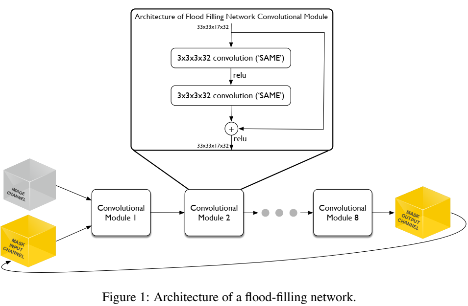
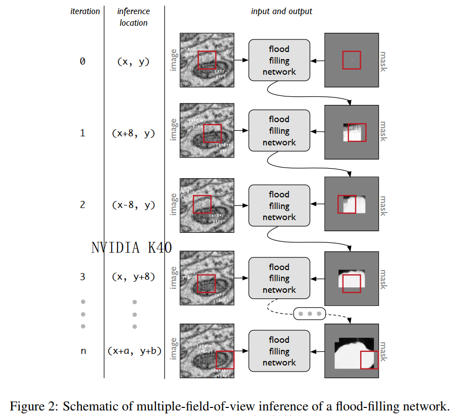
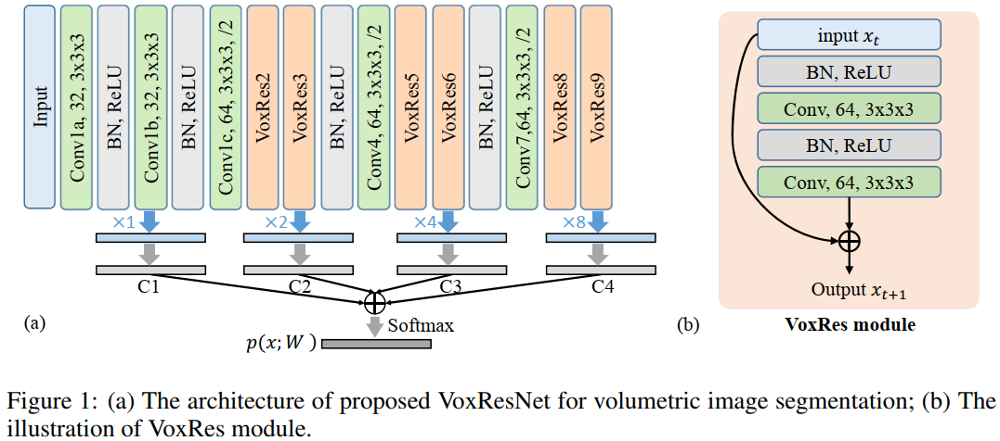
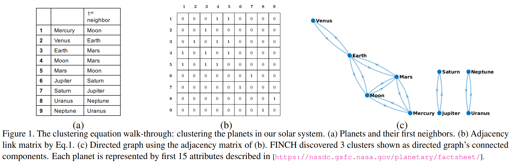

## 论文记录
1. ### [Flood-Filling Networks](https://arxiv.org/abs/1611.00421)
    > 通过从种子点出发，逐渐分割出一根神经信号，网络输出为一个概率图，每次迭代的输入是原始图像+已经分割出的概率图，输出的概率图中值较大的部分即是与种子点属于同一类型的点。这篇文章总共有3个版本  
    > [High-Precision​ ​Automated​ ​Reconstruction​ ​of​ ​Neurons​ ​with​ ​Flood-filling​ ​Networks.full](https://www.biorxiv.org/content/biorxiv/early/2017/10/09/200675.full.pdf)  
    > [High-precision automated reconstruction of neurons with flood-filling networks.nature methods](https://www.nature.com/articles/s41592-018-0049-4)

     

2. ### [VoxResNet: Deep Voxelwise Residual Networks for Volumetric Brain Segmentation](https://arxiv.org/abs/1608.05895)
    > 大脑分割, VoxResNet也是神经信号追踪使用的基础网络架构。
    
    

3. ### [Efficient Parameter-free Clustering Using First Neighbor Relations](https://arxiv.org/abs/1902.11266)
    > 一种无需参数的分成聚类方法FINCH，利用邻接矩阵来寻找聚类关系

    

4. ### [PAT—Probabilistic Axon Tracking for DenselyLabeled Neurons in Large 3-D Micrographs](https://1drv.ms/b/s!AtpgLItiDx9XsV8fBYC5fa9k_zfW?e=FLTa2m)
    > 大型三维显微照片中密集标记神经元的概率轴突跟踪。包括两个部分Locally(L-PAT)和globally(G-PAT)，先将大图像切分做小patch上的稀疏追踪，然后通过G-PAT融合在一起。G-PAT通过概率优化方法最小化全局目标函数，合并小的L-PAT模型。  
    神经信号追踪算法分类：1.体素分类识别+骨架化+树型重建(适用于有清晰背景的数据)；2.局部探索策略法，能够在局部适应不同的对比度和图像质量。

5. ### [Instance Segmentation and Tracking with Cosine Embeddings and Recurrent Hourglass Networks](https://arxiv.org/pdf/1806.02070.pdf)
    >简述: hourglass network 加上 ConvGRU 做心脏(左心室心肌和血腔)MR视频的实例分割.

6. ### [Convolutional Neural Network-Based Instance Segmentation Algorithm to Acquire Quantitative Criteria of Early Mouse Development](https://www.biorxiv.org/content/biorxiv/early/2018/06/01/324186.full.pdf)
    >简述: 小鼠胚胎发育期间的细胞核数量、体积、表面积、重心坐标定量分析, 使用QCA Net, 基于3D U-Net改进的.

7. ### [High-performance medicine: the convergence of human and artificial intelligence](https://www.nature.com/articles/s41591-018-0300-7)
    >简述: 综述型

8. ### [Deep learning for cellular image analysis](https://www.nature.com/articles/s41592-019-0403-1)
    > 简述: 综述型

9.  ### [Deep Reinforcement Learning for Subpixel Neural Tracking](http://proceedings.mlr.press/v102/dai19a/dai19a.pdf)
    > 使用强化学习, 先在合成数据上训练, 然后在真实数据上。

10. ### [Deep Reinforcement Learning for Active Breast Lesion Detection from DCE-MRI](https://cs.adelaide.edu.au/~gabriel/DRL_maicasEtAl.pdf)
    > 扩展deep Q-network检测乳腺病变(动态对比增强核磁共振图像), ResNet加上强化学习的Q-Network。

